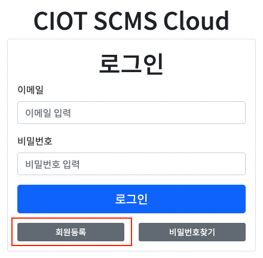
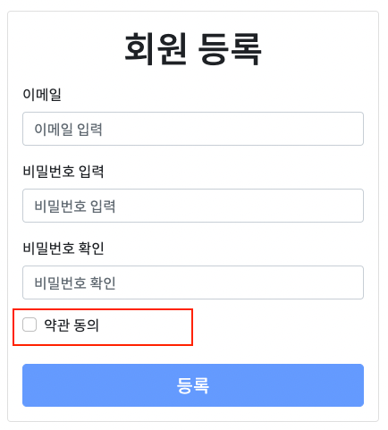
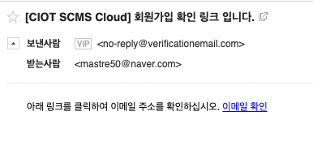

## 회원가입 및 이메일 인증

회원가입은 인증을 위한 이메일 주소만을 통해 회원가입하며\
다른 정보는 필요하지 않습니다.

### 가입절차

1. 회원등록 버튼을 클릭한다.

2. 이메일과 비밀번호를 입력하고 약관동의 체크박스를 클릭한다.

3. 팝업으로 뜨는 약관동의 팝업창에 약관동의를 하고 등록 버튼을 누르면 회원가입 확인 링크가 이메일로 발송된다. 발송된 이메일의 링크를 클릭하면 회원가입이 완료된다.

